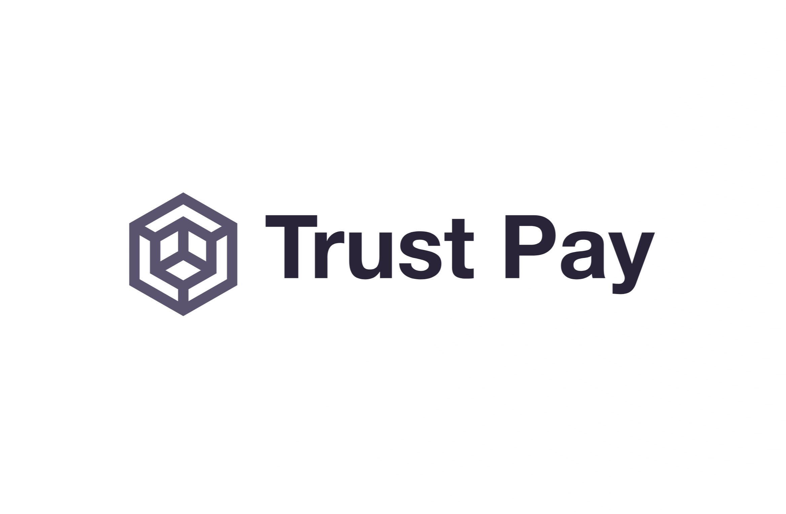
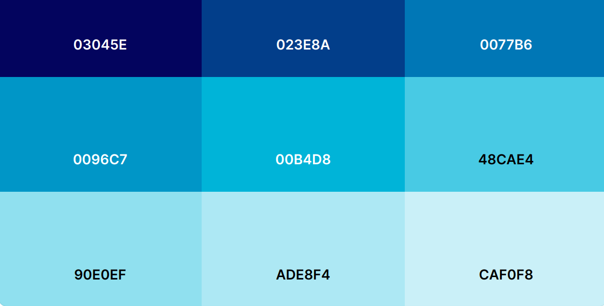
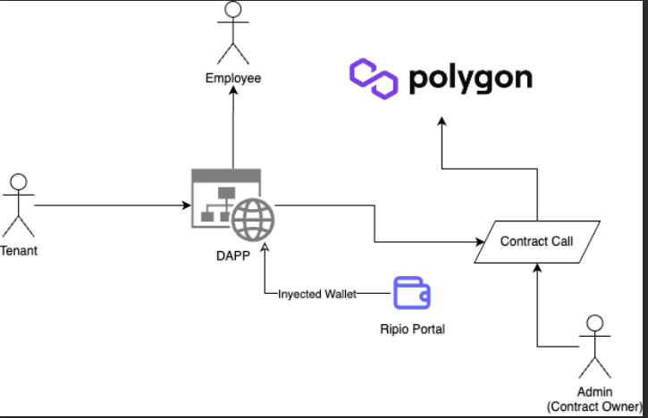

# TRUST PAY

#### Project Context: Hackaton King of Devs 2.0

March 31, April 1st, April 2nd 2023

Organizers: [Think and Dev](https://thinkanddev.com/kingofdevs/)

Location: Cordoba, Argentina

###### Participants
* Luciano Martin Garriga
* Franco Cerino
* Federico Rascon
* Benjamin Juarez

###### Mentors
* Neri Bocchi (Ripio)
* Juan Ignacio Bocchi

#### Kick-Off, Brainstorming, and Prioritization

The Hackaton begins with a time limit of developing an idea in a little less than 3 consecutive days, and sets the agenda that teams can develop whatever they want as long as the concept is useful and makes good use of the properties that a web3 environment can provide. Additional criteria is that the development is expected to be original, complete and delivered with clean code and complete functionality.

The group that is proposing the current project firstly brainstormed ideas and came to four main contesting ideas to counter weight each against the other. To evaluate each of the possible ideas to develop, the group members built an evaluation system that would comply with the hackaton context.

The first two criteria to test ideas were originality(1), and viability(2). So for each of the four ideas, the group assigned a value for these 2 categories in a score from 1 to 10. The competing ideas at the top had similar scores. So in a second instance, the group adopted a third criteria: willingness(3) to develop.

In the end, came the winner, only leaving behind a very original idea that seemed complex to develop in the assigned time, and with a potential promise to develop in the future. The scores for the winner idea, from the point of view of the group was:

1. Originality: 8
2. Viability: 10
3. Willingness: 10
4. Total Score: 28

## ROADMAP

### Concept Idea

#### Painpoint detected

Services that have intermediaries always have an additional cost. So some payment systems entail a process in which, one party (User A) pays to another party (User B), who then pays to the end party (User C). In summary, in a traditional linking relationship to make payments, there are three figures:

* A: is the user who wishes to pay for any service.
* B: is the traditional intermediary that charges a commission for the intermediation between two parties. 
* C: is the end user of the destination of the money.

#### Solution Approach and Context: new User D

The workaround in web3 is that sometimes not all parties are required. So payer A can send assets directly to C without intermediary B. This allows for quicker processes and less expensive ones. 

In the local context of this project, the development aims to comply with legal regulations, which may require that the intermediary party still exists. This project is a web3 solution where we provide more transparency and traceability to the process, showing in real time how funds move and the total balance of funds that go in and out of the smart contract. 

A new user comes in place, which is User D, who is the Contract Owner. User D, in real life, is the person that creates and updates users to the system, can send payments to User C (even though User C can still claim salairies by their own.)

#### Use Case Here

The proposed development here is a payment system, that includes custody and distribution, aiming to simplify payments for the end users (A and C) and make the process more efficient. The dApp (decentralized Application) could do without centralized intermediaries. The Contract Owner, User D, can overview transactions and add and modify users.

#### Goal

Reduce costs and speed up and secure financial transactions. Operations become transparent and public, and every payment shows its traceability with the origin and destiny of funds.

#### Other Use Cases

The context and use case described above is only a fraction of what this analysis can tackle. The pain point is generic, and the use case for payments can be found in a wide array of situations.

The dApp can be used in any field in which payers and receivers coexist: employees, partners, collaborators, etc. The dApp can be used in environments such as:

* corporations
* collaborations
* businesses
* transitional partnerships
* crowdfunding
* NGOs

### Project Scope: Administration System for Buildings and Owners

A very common use case is the control of communal expenses that are handed into a fund and then used to pay expenses of the building, services, and employee salaries.

#### Massive Adoption Angle

##### A dApp in the background: useful for FIAT users on the frontend

The idea from the project kick-off is to give a web3 solution that can be useful to a massive audience. Between the 1st party A, and the end user C the ideal plan would be to have FIAT payments and FIAT cashouts. 

##### A transparent process, under Scrow

Everything that happens in the middle should be fueled on the blockchain with Smart Contracts which make the flow secure, traceable, and simple. 

#### Users and UX

The system is aimed to be used with FIAT users with no knowledge of web3:
* Tenants
* Employees
* Admins

The user experience is expected to be as seamless as any web2 application, with the gains of working with web3 in the background.

### Project Rules and Limitations: Challenges To Overcome

What happens if:

* a tenant doesn't pay enough to cover the costs of the fund: salaries, or destination accounts? There could be a penalty such as a partial claim. Such tenants should also cover the fees for the transaction costs of activating the smart contract. 
* a tenant changes? or a tenant leaves and no one replaces them for a period of time?

### Color Palette

The spirit of the brand is to convey a serious tone in which users can rely on a system without thinking about how the technicalities workaround in the background. Blue is a cold color that represents objectivity, and calmness and does not raise alarms. The tones that aim to represent this perspective is a palette that is at the same time: simple, quick, effective, and most importantly secure and transparent. 

* Color Palette from [coolors.co: LINK  here](https://coolors.co/palette/03045e-023e8a-0077b6-0096c7-00b4d8-48cae4-90e0ef-ade8f4-caf0f8)

### System Architecture Diagram

* [Draw Diagram LINK in Google Public Folder](https://drive.google.com/file/d/1EvSddaOpwvGIHwQF9xLxwMdm0Nqso1Mr/view)

### Steps To Use The dApp

1. Admin (User D, here Contract Owner of an account on Trust Pay) adds other Users:

* Tenant. (User A)
	* Name
	* Wallet Address
	* Expenses Amount
* Employee. (User C)
	* Name
	* Wallet Address
	* Salary Amount

**On-Ramping**

2. Tenant (User A) pays

* Tenant accesses the Ripio Portal
* Tenant pays $ARS and converts them to MATIC

**Off-Ramping**

3. Employee (User C) receives payment (Standard flow)

* Admin (User D) pays salary through third party Wallet
	* Ripio
	* Lemon
	* Belo

4. Employee (User C) receives payment (Alternative flow)

* If Admin does nothing, employee (User C) claims salary. Claiming is available on two environments
	* $ARS through Trust Pay Portal (Standard Recommended)
	* MATIC through Metamask Browser Extension, or Mobile App

5. Employee (User C) uses payment received

* Uses Debit Card for Payments
* Electronic Deposit Transfer $ARS to Bank Account

### Done

* Idea Concept
* Branding
	* Product Naming
	* Logo 
	* Color Palette
* Readme Documentation version 2

### Upcoming Next 

* SmartContract: Smart contract deployed en Testent Polygon
* Research Frontend: libraries, examples, etc. Build the Dapp and connect Wallet
* Business Rules: Review case scenarios in which the tenants, and representative/leader of the community, may need to consider special situations such as extraordinary expenses.
* Installation and Deploy Guide
* List of used technologies, with links
* Bug acknowledgment and possible error corrections
* Frequently Asked Questions (FAQ)
* Copyrights, licenses, and legal considerations

### Additional Resources

* [Canva Presentation of the Project](https://www.canva.com/design/DAFe3QbNqq0/WziLfB7dX9QqUmERkc7V7w/edit?utm_content=DAFe3QbNqq0&utm_campaign=designshare&utm_medium=link2&utm_source=sharebutton)
* [LINK on How to Document a Software Project](https://cs.uns.edu.ar/~ldm/mypage/data/oc/info/guia_para_la_documentacion_de_proyectos_de_software.pdf)
