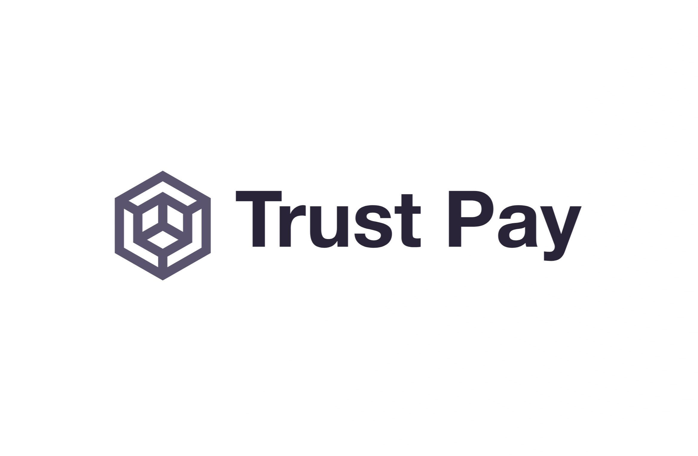
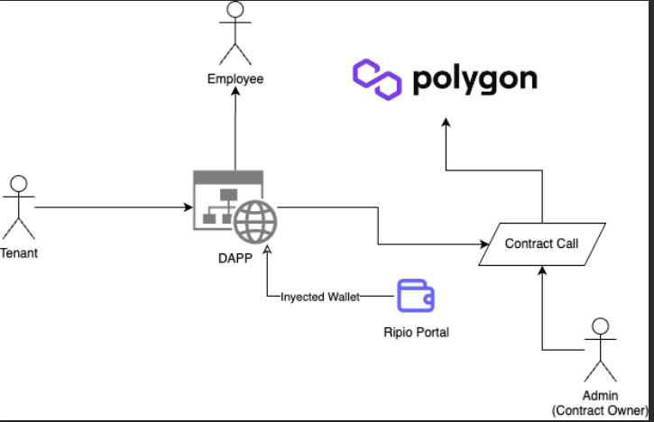

# TRUST PAY

#### Project Context: Hackaton King of Devs 2.0

March 31, April 1st, April 2nd 2023

Organizers: [Think and Dev](https://thinkanddev.com/kingofdevs/)

Location: Cordoba, Argentina

###### Participants
* Luciano Martin Garriga
* Franco Cerino
* Fede
* Benjamin Juarez

###### Mentors
* Juan Ignacio Neri Bocchi

## ROADMAP

### Concept Idea

Painpoint detected: Services that have intermediaries always have an additional cost. So some payment systems entail a process in which, one party A pays to B, who then pays to C. 

Solution Approach: The workaround in web3 is that sometimes not all parties are required. So the payer A can send assets directly to C without the intermediary B. This allows for quicker processes, and less expensive ones. 

Contextual Solution: In the local context of this project, the aim of the development is to comply with legal regulations, which may require that the intermediary party still exists. If the project includes this party, B, then the web3 solution we propose could still provide more transparency and traceability to the process.

Use Case: The proposed  development here is a payment system, that includes custody and distribution, aiming to simplify payments for the end users (A and C) and make the process more efficient. The dApp (decentralized Application) could do without centralized intermediaries.

Goal: Reduce costs and speed up and secure the financial transactions. Operations become transparent and public, and every payment shows its traceability with the origin and destiny of funds.

#### Other Use Cases

The context and use case described above are only a fraction of what this analysis can tackle. The pain point is generic, and the use case for payments can be found in a wide array of situations.

The dApp can be used in any field in which payers and receivers coexist: employees, partners, collaborators, etc. The dApp can be used in environments such as corporations, collaborations, and business.

### Project Scope: Administration System for Buildings and Owners

A very common use case is the control of communal expenses that are handed into a fund and then used to pay expenses of the building, services, and employee's salaries.

The idea from the project kick off is to give a web3 solution that can be useful to a massive audience. Between the 1st party A, and the end user C the ideal plan would be to have FIAT payments and FIAT cashouts. Eveything that happens in the middle should be fueled on the blockchain with Smart Contracts which make the flow secure, traceable, simple. 

#### Users and UX

The system is aimed to be used with FIAT users with no knowledge of web3:
* Tenants
* Employees
* Admins

The user experience is expected to be as seamless as any web2 application, with the gains of working with web3 in the background.

### Project Rules and Limitations: Challenges To Overcome

What happens if:

* a tenant doesn't pay enough to cover the costs of the fund: salaries, or destination accounts? There could be a penalty such as a partial claim. Such tenant should also cover the fees for the transaction costs of activating the smart contract. 
* a tenant changes? or a tenant leaves and no one replaces them for a period of time?

### Color Palette

The spirit of the brand is to convey a serious tone in which users can rely in a system without thinking about how the technicalities work around in the background. Blue is a cold color that represents objectivity, calmness and does not raise alarms. The tones that aim to represent this perspective is a palette that is at the same time: simple, quick, effective, and most importantly secure and transparent. 

* Color Palette from [coolors.co: LINK  here](https://coolors.co/palette/03045e-023e8a-0077b6-0096c7-00b4d8-48cae4-90e0ef-ade8f4-caf0f8)

### System Architecture Diagram

* [Draw Diagram LINK in Google Public Folder](https://drive.google.com/file/d/1EvSddaOpwvGIHwQF9xLxwMdm0Nqso1Mr/view)

### Done

* Idea Concept
* Branding
	* Product Naming
	* Logo 
	* Color Palette
* Readme Documentation version 1

### Upcoming Next 

* SmartContract: Smart contract deployed en Testent Polygon
* Research Frontend: libraries, examples etc.. build the Dapp and connect Wallet
* Business Rules: Review case scenarios in which the tenants, and representative/leader of the community, may need to consider special situations such as extraordinary expenses.
* Installation and Deploy Guide
* List of used technologies, with links
* Bug acknowledgment and possible error corrections
* Frequently Asked Questions (FAQ)
* Copyrights, licences, and legal considerations

### Additional Resources

* [LINK on How to Document a Software Project](https://cs.uns.edu.ar/~ldm/mypage/data/oc/info/guia_para_la_documentacion_de_proyectos_de_software.pdf)
